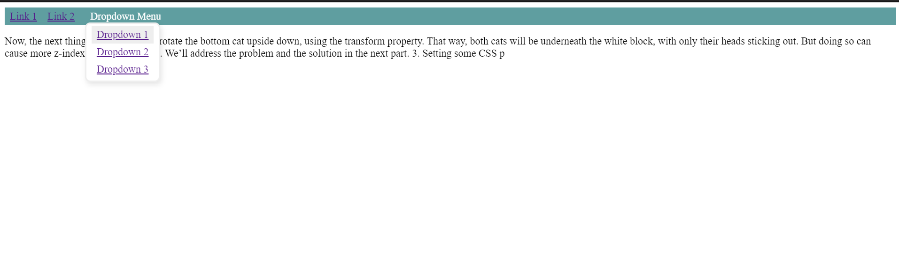

# JS-DropdownMenu
A bare minimum importable module for JavaScript drop down menus



## To install module

Add the following JavaScript code to your main js file
```JavaScript
import MenuHandler from '@aaronrory/js-dropdownmenu';

const menuHandler =  new MenuHandler();
menuHandler.constructMenus();
```
To install the module use the command:
```npm install @aaronrory/js-dropdownmenu --save```

## Instructions

Simply follow the similar layout to add this dropbox functionality to your html page.
You must have two main div elements with the ``` data-dropDownMenu = "verticle" ``` attribute for the parent and
``` data-dropDownContent = "true" ``` attribute in the child div containing the dropdown links or items.

```html
<div data-dropDownMenu="verticle">
  <span>Dropdown Menu</span>
  <div data-dropDownContent ="true">
    <a href="#">Dropdown 1</a>
    <a href="#">Dropdown 2</a>
    <a href="#">Dropdown 3</a>
  </div>
</div>
```

## [Live Link](https://raw.githack.com/Aaron-RN/JS-DropdownMenu/gitshow/dist/index.html)

## Built With

- HTML, CSS
- JavaScript
- Node.js
- NPM Webpack

## Authors

👤 **Aaron Rory**

- Github: [@Aaron-RN](https://github.com/Aaron-RN)
- Twitter: [@ARNewbold](https://twitter.com/ARNewbold)
- Linkedin: [Aaron Newbold](https://www.linkedin.com/in/aaron-newbold-1b9233187/)

## 🤝 Contributing

Contributions, issues and feature requests are welcome!

Feel free to check the [issues page](issues/).

## Show your support

Give a ⭐️ if you like this project!

## 📝 License

This project is [MIT](lic.url) licensed.
